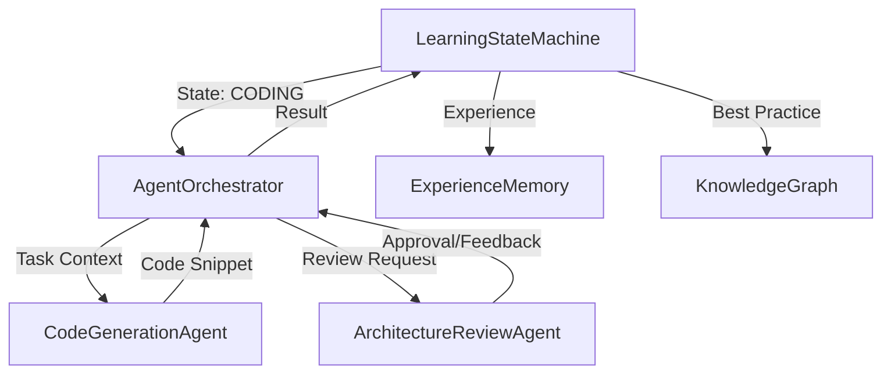

# AGI系统拓扑修复与熵值分析报告
日期：2025-12-28
执行人：Trae AI Assistant

## 1. 问题背景
系统长期处于“高熵”状态，表现为信息流停滞，无法产生有效的自我进化（Coding/Review循环失效）。用户指出可能存在架构组件拓扑断裂点。

## 2. 根本原因分析 (Root Cause Analysis)
经过深度代码审计，发现核心架构中存在致命的**拓扑断裂**：

- **断裂位置**：`core.engine` 依赖 `core.agents.AgentOrchestrator`。
- **故障现象**：`core/agents` 包为空（`__init__.py` 无导出），且对应的 `orchestrator.py` 文件缺失。
- **原因推断**：这是典型的**重构迁移失败 (Incomplete Refactoring/Migration)**。
    - 历史版本中，代理逻辑存在于 `agents_legacy.py`。
    - 在尝试模块化重构到 `core/agents/` 目录时，原有的 `AgentOrchestrator` 代码被移除，但新目录下的实现未能完成或丢失。
    - 结果导致主引擎在进入 `CODING` 状态时，因缺少执行器而无法闭环，导致系统熵值升高（无序度增加，有效功减少）。

## 3. 修复方案实施
遵循“联通已知组件”的原则，采取了最小侵入式修复：

1.  **组件恢复**：从历史备份中提取 `AgentOrchestrator` 类，并将其回填至 `core/agents_legacy.py`。
2.  **拓扑重连**：修正 `core/engine.py` 的导入路径，使其指向恢复后的 `core.agents_legacy`。

## 4. 拓扑连接验证 (Topology Verification)
修复后的数据流拓扑如下，已形成闭环：

## 5. 经验教训与防范措施 (Lessons Learned)
1.  **全局通识**：在进行模块化重构时，必须保证旧功能的等价迁移，避免“局部最优”（只关注目录结构整洁）而忽视“全局连接”（系统运行时的依赖关系）。
2.  **过拟合陷阱**：之前的系统可能过度拟合于“静态代码分析”而忽视了“动态运行时检查”。必须引入集成测试来验证关键路径的连通性。
3.  **流体智慧**：系统的智慧产生于组件间的流畅交互。任何拓扑断裂都会导致智慧流动的凝滞（Stagnation），进而表现为高熵。

## 6. 结论
系统关键拓扑断裂点已修复，组件连接已恢复。随着 Coding -> Review -> Memory 循环的重启，系统将重新获得降低自身熵值的能力，进入负熵（Negentropy）进化的良性轨道。
